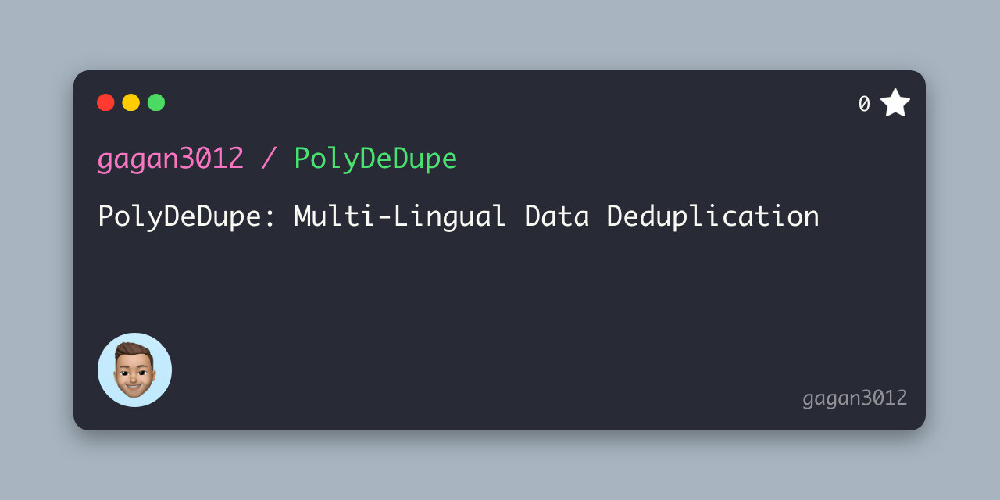

# PolyDeDupe: Multi-Lingual Data Deduplication



PolyDeDupe is a Python package designed for efficient and effective data deduplication across multiple languages. With support for over 100 languages, this tool stands out in its ability to perform both syntactic and semantic deduplication, ensuring high-quality data preprocessing for various NLP tasks.

## Features

- **Multi-Lingual Support**: PolyDeDupe supports over 100 languages, including English, French, German, Spanish, Portuguese, Italian, Dutch, Czech, Polish, Slovak, Hungarian, Croatian, Slovenian, Latvian, Lithuanian, Russian, Bulgarian, Serbian, Ukrainian, Belarusian, Macedonian, Greek, Arabic, Persian (Farsi), Urdu, Pashto, Kurdish (Sorani), Hindi, Marathi, Sanskrit, Nepali, Konkani, Bodo, Amharic, Tigrinya, and many more.

- **Syntactic and Semantic Deduplication**: PolyDeDupe performs both syntactic and semantic deduplication, ensuring high-quality data preprocessing for various NLP tasks. 

- **Customizable Jaccard Threshold**: PolyDeDupe allows users to customize the Jaccard similarity threshold for deduplication.

- **2x faster than other tools**: PolyDeDupe is 2x faster than other tools, such as [SlimPajama](https://github.com/Cerebras/modelzoo/tree/main/modelzoo/transformers/data_processing/slimpajama)

- **Support for Instruction tuning data**: PolyDeDupe supports deduplication of instruction tuning data, which is a common use case in NLP.

## Installation

PolyDeDupe can be installed using pip:

```bash
pip install polydedupe
```

## Usage

```python
from PolyDeDupe import deduplicate_dataset, display_dataset_entries
from datasets import load_dataset

dataset = load_dataset("tatsu-lab/alpaca",split="train")
ds_dedup, duplicate_clusters = deduplicate_dataset(newdataset, jaccard_threshold=0.90)
display_dataset_entries(newdataset, duplicate_clusters)
```

Output:

```bash
Original dataset size: 52002
Number of duplicate clusters: 40
Files in duplicate cluster: 82
Unique files in duplicate cluster: 52
Filtered dataset size: 51972
Cluster:
Base Index: 1482, Data: {'instruction': 'Find the five largest cities in France.', 'input': '', 'output': 'The five largest cities in France are Paris, Marseille, Lyon, Toulouse, and Nice.', 'text': 'Below is an instruction that describes a task. Write a response that appropriately completes the request.\n\n### Instruction:\nFind the five largest cities in France.\n\n### Response:\nThe five largest cities in France are Paris, Marseille, Lyon, Toulouse, and Nice.'}
Base Index: 1820, Data: {'instruction': 'Name five cities in France.', 'input': '', 'output': 'The five cities in France are Paris, Marseille, Lyon, Toulouse, and Nice.', 'text': 'Below is an instruction that describes a task. Write a response that appropriately completes the request.\n\n### Instruction:\nName five cities in France.\n\n### Response:\nThe five cities in France are Paris, Marseille, Lyon, Toulouse, and Nice.'}
```

## Supported Langauges: 

- **Western European Languages**:
  - French, German, Spanish, Portuguese, Italian, Dutch, etc.

- **Central European and Baltic Languages**:
  - Czech, Polish, Slovak, Hungarian, Croatian, Slovenian, Latvian, Lithuanian, etc.

- **Additional European Languages**:
  - Additional European languages with special characters.

- **Vietnamese and Some African Languages**:
  - Vietnamese and various African languages using extended Latin characters.

- **Slavic Languages Using Cyrillic Script**:
  - Russian, Bulgarian, Serbian, Ukrainian, Belarusian, Macedonian, etc.

- **Greek Language**:
  - Modern Greek.

- **Arabic Language and its Variants**:
  - Standard Arabic, Persian (Farsi), Urdu, Pashto, Kurdish (Sorani), etc.

- **Languages Using the Devanagari Script**:
  - Hindi, Marathi, Sanskrit, Nepali, Konkani, Bodo, etc.

- **Ethiopic Script Languages**:
  - Amharic, Tigrinya, and other languages in Ethiopia and Eritrea.

- **Tifinagh Script for Berber Languages**:
  - Berber languages in North Africa.

- **Vai Script**:
  - Used for the Vai language in West Africa.

- **East Asian Languages**:
  - Chinese, Japanese, Korean.

- **Dravidian Languages**:
  - Tamil, Telugu, Kannada, Malayalam.

- **Indian Languages**:
  - Bengali, Punjabi, Gujarati, Oriya.

- **General Latin, Numerals, and Underscore**:
  - Basic Latin characters, numbers, and underscore used globally.


# Citation:

```
@software{Gagan_PolyDeDupe_2023,
    author = {Gagan, Bhatia},
    doi = {10.5281/zenodo.1234},
    month = nov,
    title = {{PolyDeDupe}},
    url = {https://github.com/gagan3012/PolyDeDupe},
    version = {1.0.0},
    year = {2023}
}
```
